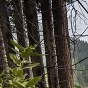
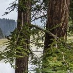
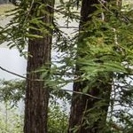
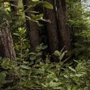
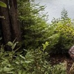
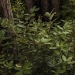
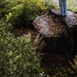

## Split any image with any degree of overlap.
### Divide image of any size into smaller images of fixed size with any degree of overlapping.

#### Overlapping means some part of the previous image is repeated in the current image. For example, 50% overlap means half of the previous image is repeated in the current image, both horizontally and vertically.

#### If the image is not completely divisible, the degree of overlapping on the boundary images are increased such that they become divisible.

### Example 
#### Sample Image(580x435)

#### Splitted images(150x150) with 50% overlap

|   |   |   |   |   |   |   |
|:-:|:-:|:-:|:-:|:-:|:-:|:-:|
|   |   |   |   |   |   |   |
|   |   |   |   |   |   |   |
|   |   |   |   |   |   |   |
|   |   |   |   |   |   |   |

### Image splitting can be used to
 - Get fixed size images from image of any size.
 - Generate partial fingerprints from any given fingerprint sample.
